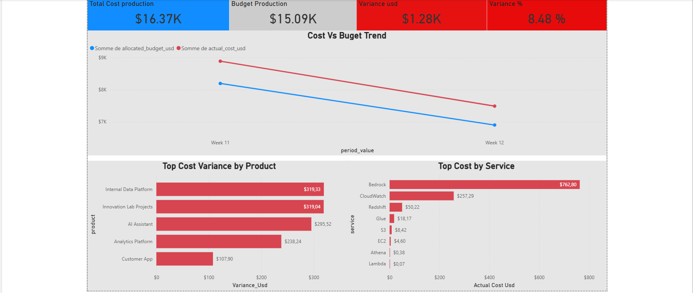
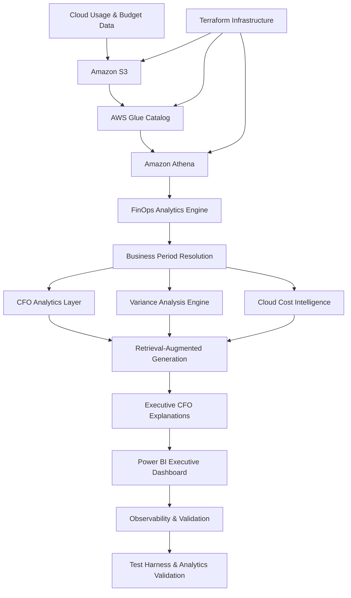

# CFO FinOps AI Platform — Cloud Cost Intelligence & Executive Decision System

## AWS Athena • Power BI • RAG • FinOps • Terraform • CFO AI

## Executive Summary



CFO FinOps AI Platform is a production-style cloud-native financial intelligence and executive analytics system designed to simulate enterprise FinOps operations, AI-assisted cloud cost analysis, Retrieval-Augmented Generation (RAG), executive reporting workflows, and production-grade validation pipelines.

The platform combines AWS cloud analytics, Athena-based querying, Power BI executive dashboards, AI-driven financial explanations, observability, and validation systems into a unified CFO-oriented decision intelligence architecture.

---

## Key Production Features

- AWS Athena cloud analytics workflows
- Amazon S3 + Glue cloud data architecture
- Retrieval-Augmented Generation (RAG) financial intelligence layer
- Executive Power BI dashboard orchestration
- AI-generated CFO financial summaries
- Dynamic business period resolution engine
- Cloud cost variance analysis workflows
- Validation and analytics testing suites
- Terraform Infrastructure as Code (IaC)
- Production-style observability and orchestration

---

## Core Engineering Domains

- AI Engineering
- Cloud Data Engineering
- FinOps Analytics
- Retrieval-Augmented Generation (RAG)
- Executive Decision Intelligence
- Analytics Engineering
- Cloud Cost Optimization
- Observability & Validation
- Production AI Systems
- Business Intelligence Engineering

---

## Tech Stack

| Category | Technologies |
|---|---|
| Cloud | AWS |
| Analytics | Amazon Athena |
| Storage | Amazon S3 |
| Metadata | AWS Glue |
| Infrastructure as Code | Terraform |
| AI / RAG | Retrieval-Augmented Generation (RAG) |
| Dashboarding | Power BI |
| Language | Python |
| Validation | Analytics Validation & RAG Testing |
| Observability | Production Monitoring Workflows |

---


## High-Level Architecture


Production-style cloud-native CFO FinOps architecture combining AWS analytics, RAG intelligence, executive reporting, validation pipelines, and Infrastructure as Code.



---

## Key Engineering Achievements

- Built a production-style cloud-native CFO FinOps AI platform
- Engineered Athena-based cloud financial analytics workflows
- Designed Retrieval-Augmented Generation (RAG) financial explanation systems
- Implemented executive Power BI reporting orchestration
- Built dynamic business period resolution logic
- Implemented cloud cost variance analytics workflows
- Developed validation and analytics testing pipelines
- Integrated Infrastructure as Code using Terraform
- Built production-style observability workflows
- Designed AI-assisted executive financial intelligence systems

---

## Validation & Analytics

| Validation Area | Status |
|---|---|
| FinOps Analytics Validation | PASSED |
| RAG Validation | PASSED |
| Executive Summary Validation | PASSED |
| Power BI Integration Testing | PASSED |
| Athena Query Validation | PASSED |
| Period Resolution Validation | PASSED |
| Hybrid Response Validation | PASSED |

---

## Local Execution

Run the main CFO FinOps AI workflow:

```bash
python agent_entree_finopsrag.py
```

Run analytics validation:

```bash
python analytics_test_harness.py
```

Run CFO evaluation suite:

```bash
python cfo_evaluation_suite.py
```

Run RAG validation:

```bash
python rag_test_harness.py
```

---

## Project Structure

```text
aws-cfo-finops-rag/
│
├── data/                  # Financial datasets and RAG corpus
├── files_for_chatgpt/     # Exported AI context files
├── finops_docs/           # FinOps documentation
├── outputs/               # Generated outputs and reports
├── src/                   # RAG and semantic retrieval modules
├── terraform/             # Infrastructure as Code
│
├── agent_entree_finopsrag.py
├── cfo_finops_athena_rag_final.py
├── finops_agent_athena.py
├── generate_cfo_summary.py
├── powerbi_refresh.py
├── analytics_test_harness.py
├── rag_test_harness.py
│
└── README.md
```

---

## Why This Project Matters

This project demonstrates the intersection of:

- AI Engineering
- Cloud Financial Operations (FinOps)
- Cloud Data Engineering
- Executive Decision Intelligence
- Retrieval-Augmented Generation (RAG)
- Business Intelligence Engineering
- Cloud Analytics
- Production AI Systems
- Validation & Reliability Engineering

---

## Author

Felix Brillant  
AI / Cloud Data Engineering